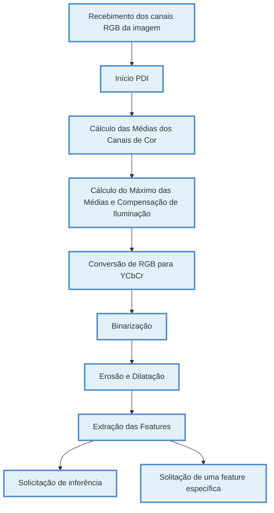

# FPGA Verilog Code

Receives an image, stores it in BRAM and then sends it back.

## SPI Connection

| PIN  | RPi5    | FPGA      |
| ---- | ------- | --------- |
| MOSI | GPIO 10 | GPIO_0_D1 |
| MISO | GPIO 9  | GPIO_0_D0 |
| SCK  | GPIO 11 | GPIO_0_D2 |
| SS   | GPIO 7  | GPIO_0_D3 |
| GND  | PIN 20  | PIN 12    |

# Pipeline de Reconhecimento de Gestos

Este diagrama descreve as etapas sequenciais de processamento da pipeline utilizada para o reconhecimento de gestos, conforme o modelo descrito por Gupta, Sehrawat e Khosla (2012).

